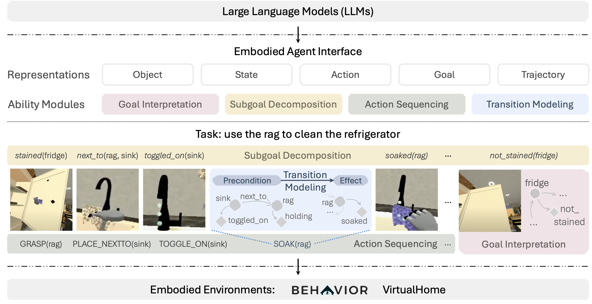

<h1 align="center">Embodied Agent Interface (EAI): Benchmarking LLMs for Embodied Decision Making</h1>

<p align="center">
    <a href="https://arxiv.org/abs/2410.07166">
        
    </a>
    <a href="https://embodied-agent-interface.github.io/">
        
    </a>
    <a href="https://huggingface.co/datasets/Inevitablevalor/EmbodiedAgentInterface" target="_blank">
        
    </a>
    <a href="https://hub.docker.com/repository/docker/jameskrw/eai-eval/general">
        
    </a>
    <a href="https://embodied-agent-eval.readthedocs.io/en/latest/#">
        
    </a>
    <a href="https://opensource.org/licenses/MIT">
        
    </a>
<!--     <a href="https://github.com/embodied-agent-interface/embodied-agent-interface/tree/main/dataset">
        
    </a> -->
</p>

<p align="center">
    <a href="https://limanling.github.io/">Manling Li</a>, 
    <a href="https://www.linkedin.com/in/shiyu-zhao-1124a0266/">Shiyu Zhao</a>, 
    <a href="https://qinengwang-aiden.github.io/">Qineng Wang</a>, 
    <a href="https://jameskrw.github.io/">Kangrui Wang</a>, 
    <a href="https://bryanzhou008.github.io/">Yu Zhou</a>, 
    <a href="https://example.com/sanjana-srivastava">Sanjana Srivastava</a>, 
    <a href="https://example.com/cem-gokmen">Cem Gokmen</a>, 
    <a href="https://example.com/tony-lee">Tony Lee</a>, 
    <a href="https://sites.google.com/site/lieranli/">Li Erran Li</a>, 
    <a href="https://example.com/ruohan-zhang">Ruohan Zhang</a>, 
    <a href="https://example.com/weiyu-liu">Weiyu Liu</a>, 
    <a href="https://cs.stanford.edu/~pliang/">Percy Liang</a>, 
    <a href="https://profiles.stanford.edu/fei-fei-li">Li Fei-Fei</a>, 
    <a href="https://jiayuanm.com/">Jiayuan Mao</a>, 
    <a href="https://jiajunwu.com/">Jiajun Wu</a>
</p>
<p align="center">Stanford Vision and Learning Lab, Stanford University</p>

<p align="center">
    <a href="https://cs.stanford.edu/~manlingl/projects/embodied-eval" target="_blank">
        
    </a>
</p>

# Dataset Highlights

-  Standardized goal specifications.
-  Standardized modules and interfaces.
-  Broad coverage of evaluation and fine-grained metrics.
-  Please find our dataset at [this link](https://huggingface.co/datasets/Inevitablevalor/EmbodiedAgentInterface).
-  PDDL files for both BEHAVIOR ([domain file](https://github.com/embodied-agent-interface/embodied-agent-interface/blob/main/src/virtualhome_eval/resources/behavior/behavior.pddl), [problem files](https://github.com/embodied-agent-interface/embodied-agent-interface/tree/main/src/virtualhome_eval/resources/behavior/problem_pddl)) and VirtualHome ([domain file](https://github.com/embodied-agent-interface/embodied-agent-interface/blob/main/src/virtualhome_eval/resources/virtualhome/virtualhome.pddl), [problem files](https://github.com/embodied-agent-interface/embodied-agent-interface/tree/main/src/virtualhome_eval/resources/virtualhome/problem_pddl)). 

# Overview

We aim to evaluate Large Language Models (LLMs) for embodied decision-making. While many works leverage LLMs for decision-making in embodied environments, a systematic understanding of their performance is still lacking. These models are applied in different domains, for various purposes, and with diverse inputs and outputs. Current evaluations tend to rely on final success rates alone, making it difficult to pinpoint where LLMs fall short and how to leverage them effectively in embodied AI systems.

To address this gap, we propose the **Embodied Agent Interface (EAI)**, which unifies:
1. A broad set of embodied decision-making tasks involving both state and temporally extended goals.
2. Four commonly used LLM-based modules: goal interpretation, subgoal decomposition, action sequencing, and transition modeling.
3. Fine-grained evaluation metrics, identifying errors such as hallucinations, affordance issues, and planning mistakes.

Our benchmark provides a comprehensive assessment of LLM performance across different subtasks, identifying their strengths and weaknesses in embodied decision-making contexts.

# Installation
1. **Create and Activate a Conda Environment**:
   ```bash
   conda create -n eai-eval python=3.8 -y 
   conda activate eai-eval
   ```

2. **Install `eai`**:
   
   You can install it from pip:
   ```bash
   pip install eai-eval
   ```

   Or, install from source:
   ```bash
   git clone https://github.com/embodied-agent-interface/embodied-agent-interface.git
   cd embodied-agent-interface
   pip install -e .
   ```

3. **(Optional) Test PDDL planner for transition modeling**:
    If you want to evaluate `transition_modeling`, it is highly recommended to test the installation of PDDL planner. You can test by running
    ```bash
    python examples/pddl_tester.py
    ```
    If the output is `Results:
    ['walk_towards character light', 'switch_on character light']`, the installation is successful. Otherwise, you can refer to the `BUILD.md` under `pddlgym_planners/` or [this](https://github.com/embodied-agent-interface/embodied-agent-interface/blob/main/examples/build_troubleshooting.md) for more instructions.


4. **(Optional) Install iGibson for behavior evaluation**:
   
   If you need to use `behavior_eval`, install iGibson. Follow these steps to minimize installation issues:

   - Make sure you are using Python 3.8 and meet the minimum system requirements in the [iGibson installation guide](https://stanfordvl.github.io/iGibson/installation.html).
   
   - Install CMake using Conda (do not use pip):
     ```bash
     conda install cmake
     ```

   - Install `iGibson`:
     We provide an installation script:
     ```bash
     python -m behavior_eval.utils.install_igibson_utils
     ```
     Alternatively, install it manually:
     ```bash
     git clone https://github.com/embodied-agent-interface/iGibson.git --recursive
     cd iGibson
     pip install -e .
     ```

   - Download assets:
     ```bash
     python -m behavior_eval.utils.download_utils
     ```

   We have successfully tested installation on Linux, Windows 10+, and macOS.

# Quick Start

1. **Arguments**:
   ```bash
   eai-eval \
     --dataset {virtualhome,behavior} \
     --mode {generate_prompts,evaluate_results} \
     --eval-type {action_sequencing,transition_modeling,goal_interpretation,subgoal_decomposition} \
     --llm-response-path <path_to_responses> \
     --output-dir <output_directory> \
     --num-workers <number_of_workers>
   ```

   Run the following command for further information:
   ```bash
   eai-eval --help
   ```

2. **Examples**:

-  ***Evaluate Results***
   
   
   Make sure to download our results first if you don't want to specify <path_to_responses>
   ```bash
   python -m eai_eval.utils.download_utils
   ```

   Then, run the commands below:
   ```bash
   eai-eval --dataset virtualhome --eval-type action_sequencing --mode evaluate_results
   eai-eval --dataset virtualhome --eval-type transition_modeling --mode evaluate_results
   eai-eval --dataset virtualhome --eval-type goal_interpretation --mode evaluate_results
   eai-eval --dataset virtualhome --eval-type subgoal_decomposition --mode evaluate_results
   eai-eval --dataset behavior --eval-type action_sequencing --mode evaluate_results
   eai-eval --dataset behavior --eval-type transition_modeling --mode evaluate_results
   eai-eval --dataset behavior --eval-type goal_interpretation --mode evaluate_results
   eai-eval --dataset behavior --eval-type subgoal_decomposition --mode evaluate_results
   ```

-  ***Generate Pormpts***
   
   
   To generate prompts, you can run:
   ```bash
   eai-eval --dataset virtualhome --eval-type action_sequencing --mode generate_prompts
   eai-eval --dataset virtualhome --eval-type transition_modeling --mode generate_prompts
   eai-eval --dataset virtualhome --eval-type goal_interpretation --mode generate_prompts
   eai-eval --dataset virtualhome --eval-type subgoal_decomposition --mode generate_prompts
   eai-eval --dataset behavior --eval-type action_sequencing --mode generate_prompts
   eai-eval --dataset behavior --eval-type transition_modeling --mode generate_prompts
   eai-eval --dataset behavior --eval-type goal_interpretation --mode generate_prompts
   eai-eval --dataset behavior --eval-type subgoal_decomposition --mode generate_prompts
   ```

-  ***Simulation***


      To see the effect of our magic actions, refer to this [notebook](https://github.com/embodied-agent-interface/embodied-agent-interface/blob/main/examples/action_sequencing_simulation.ipynb).
  


3. **Evaluate All Modules in One Command**


   To evaluate all modules with default parameters, use the command below:
   ```bash
   eai-eval --all
   ```
   This command will automatically traverse all unspecified parameter options.

   **Example Usage**:
   ```bash
   eai-eval --all --dataset virtualhome
   ```
   This will run both `generate_prompts` and `evaluate_results` for all modules in the `virtualhome` dataset. Make sure to download our results first if you don't want to specify <path_to_responses>

# Docker
We provide a ready-to-use Docker image for easy installation and usage.

First, pull the Docker image from Docker Hub:
```bash
docker pull jameskrw/eai-eval
```

Next, run the Docker container interactively:

```bash
docker run -it jameskrw/eai-eval
```

Test docker

```bash
eai-eval
```
By default, this will start generating prompts for goal interpretation in Behavior.


# BibTex

If you find our work helpful, please consider citing it:

```bash
@inproceedings{li2024embodied,
  title={Embodied Agent Interface: Benchmarking LLMs for Embodied Decision Making},
  author={Li, Manling and Zhao, Shiyu and Wang, Qineng and Wang, Kangrui and Zhou, Yu and Srivastava, Sanjana and Gokmen, Cem and Lee, Tony and Li, Li Erran and Zhang, Ruohan and others},
  booktitle={NeurIPS 2024},
  year={2024}
}
```

